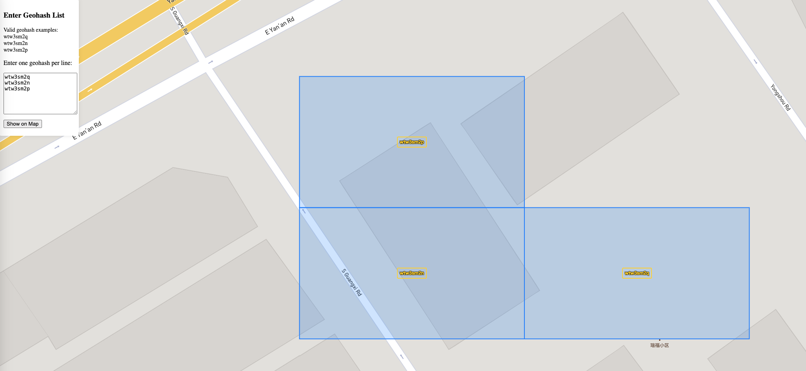

# Geohash display web tools
This repository contains a simple web page for displaying geohashes on the Mapbox map.

## 💡 Usage:
This is a simple static web page that can be opened in any modern web browser or hosted on a web server.
1. Clone the repository or download the `index.html` file.
2. Replace the `MAPBOX_ACCESS_TOKEN` in the `index.html` file with your own Mapbox access token.
3. Open the `index.html` file in your web browser.

## ⚠️Note:
You should replace your `MAPBOX_ACCESS_TOKEN` in the `index.html` file with your own Mapbox access token to use the map features.

## Example:
